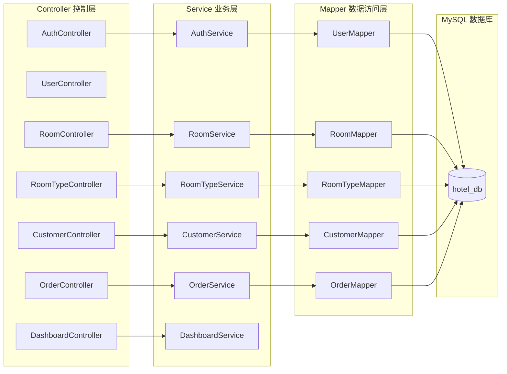
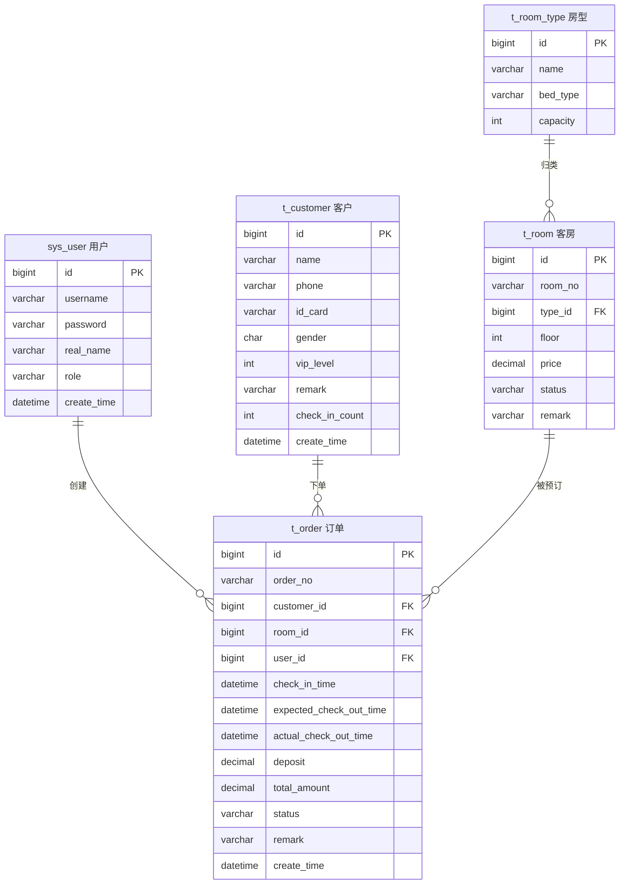

# 锦程酒店运营管理系统 - 技术架构文档

## 1. 架构设计

```mermaid
flowchart TD
    subgraph "前端层 Vue 2 SPA"
        "浏览器" --> "Vue Router" --> "Vue 页面组件"
        "Vue 页面组件" --> "Element UI"
        "Vue 页面组件" --> "Vuex Store"
    end
    subgraph "网络通信层"
        "Axios 请求" --> "RESTful API"
    end
    subgraph "后端层 Spring Boot"
        "Controller 控制层" --> "Service 业务层"
        "Service 业务层" --> "Mapper 数据访问层"
        "Mapper 数据访问层" --> "MyBatis"
        "MyBatis" --> "MySQL 数据库"
    end
    "Vuex Store" --> "Axios 请求"
    "RESTful API" --> "Controller 控制层"
```

### 架构说明

- **前后端分离**：前端使用 Vue 2 单页应用，后端使用 Spring Boot 提供 RESTful API，通过 Axios 进行 HTTP 通信
- **后端经典三层架构**：Controller（接收请求）→ Service（业务逻辑）→ Mapper（数据访问）→ MySQL（数据存储）
- **技术栈符合大二水平**：前端使用 Vue 2 + Element UI + Options API，后端使用 Spring Boot + MyBatis + MySQL，避免 TypeScript、Pinia、Vite、分布式、微服务、缓存等进阶内容
- **数据持久化**：使用 MySQL 数据库存储所有业务数据，项目启动时通过 `hotel.sql` 初始化脚本注入示例数据

## 2. 技术栈说明

### 2.1 前端

| 技术 | 版本 | 用途 |
|------|------|------|
| Vue | 2.6+ | 前端框架，使用 Options API 编写组件 |
| Vue CLI | 4.x / 5.x | 项目脚手架与构建工具 |
| Element UI | 2.15.x | UI 组件库 |
| Vue Router | 3.x | 前端路由 |
| Vuex | 3.x | 全局状态管理 |
| Axios | 0.27.x / 1.x | HTTP 请求库 |
| ECharts | 5.x | 营收统计图表 |
| 图标 | - | Element UI 内置图标 |

### 2.2 后端

| 技术 | 版本 | 用途 |
|------|------|------|
| JDK | 1.8 / 17 | Java 运行环境 |
| Spring Boot | 2.7.x | 后端框架 |
| Spring Web | - | 构建 RESTful API |
| MyBatis | 2.3.x | ORM 框架，操作数据库 |
| MySQL | 8.0.x | 关系型数据库 |
| Maven | 3.8+ | 项目构建与依赖管理 |
| Lombok | 1.18.x | 简化实体类代码（可选） |

### 2.3 开发环境

- 前端运行：`npm install` → `npm run serve`
- 后端运行：配置 MySQL 数据库 → 执行 `hotel.sql` 建表并导入初始数据 → 启动 Spring Boot 主类
- 端口约定：前端 `http://localhost:8081`，后端 `http://localhost:8080`
- 跨域处理：后端配置 `CORS` 允许前端地址访问

## 3. 路由定义

| 路由路径 | 页面名称 | 访问控制 | 说明 |
|----------|----------|----------|------|
| `/login` | 登录页 | 公开 | 账号密码登录 |
| `/` | 首页重定向 | 需登录 | 重定向至 `/dashboard` |
| `/dashboard` | 首页看板 | 需登录 | 数据统计与快捷入口 |
| `/rooms` | 客房管理 | 需登录 | 客房 CRUD 与房态筛选 |
| `/rooms/types` | 房型维护 | 需登录 | 房型字典管理 |
| `/customers` | 客户管理 | 需登录 | 客户 CRUD 与搜索 |
| `/checkin` | 入住退房 | 需登录 | 办理入住、在住列表、办理退房 |
| `/orders` | 订单管理 | 需登录 | 订单列表、筛选、详情 |
| `/orders/stats` | 营收统计 | 需登录 | ECharts 统计图表 |
| `/profile` | 个人中心 | 需登录 | 修改密码、退出登录 |
| `/:pathMatch(.*)*` | 404 页 | 公开 | 未匹配路由 |

### 路由守卫

- `beforeEach` 校验 `localStorage` 中的登录 token，未登录跳转 `/login`
- 登录页已登录时自动跳转 `/dashboard`

## 4. API 定义

### 4.1 统一响应结构

```json
{
  "code": 0,
  "message": "操作成功",
  "data": {}
}
```

- `code = 0` 表示成功，非 0 表示失败
- `message` 为提示信息
- `data` 为返回数据

### 4.2 接口列表

| 模块 | 方法 | 接口路径 | 说明 |
|------|------|----------|------|
| 认证 | POST | `/api/auth/login` | 登录，返回 token |
| 认证 | POST | `/api/auth/logout` | 登出 |
| 认证 | POST | `/api/auth/password` | 修改密码 |
| 用户 | GET | `/api/user/info` | 获取当前登录用户信息 |
| 客房 | GET | `/api/rooms` | 客房列表（分页+筛选） |
| 客房 | GET | `/api/rooms/{id}` | 客房详情 |
| 客房 | POST | `/api/rooms` | 新增客房 |
| 客房 | PUT | `/api/rooms/{id}` | 编辑客房 |
| 客房 | DELETE | `/api/rooms/{id}` | 删除客房 |
| 客房 | PUT | `/api/rooms/{id}/status` | 修改客房状态 |
| 房型 | GET | `/api/room-types` | 房型列表 |
| 房型 | POST | `/api/room-types` | 新增房型 |
| 房型 | PUT | `/api/room-types/{id}` | 编辑房型 |
| 房型 | DELETE | `/api/room-types/{id}` | 删除房型 |
| 客户 | GET | `/api/customers` | 客户列表（分页+搜索） |
| 客户 | GET | `/api/customers/{id}` | 客户详情 |
| 客户 | POST | `/api/customers` | 新增客户 |
| 客户 | PUT | `/api/customers/{id}` | 编辑客户 |
| 客户 | DELETE | `/api/customers/{id}` | 删除客户 |
| 订单 | GET | `/api/orders` | 订单列表（分页+筛选） |
| 订单 | GET | `/api/orders/{id}` | 订单详情 |
| 订单 | POST | `/api/orders/checkin` | 办理入住 |
| 订单 | POST | `/api/orders/{id}/checkout` | 办理退房 |
| 订单 | POST | `/api/orders/{id}/cancel` | 取消订单 |
| 统计 | GET | `/api/orders/stats` | 营收统计 |
| 看板 | GET | `/api/dashboard` | 首页看板数据 |

### 4.3 核心接口说明

#### 登录

```http
POST /api/auth/login
Content-Type: application/json

{
  "username": "admin",
  "password": "123456"
}
```

响应：

```json
{
  "code": 0,
  "message": "登录成功",
  "data": {
    "token": "jwt-token-string",
    "user": {
      "id": 1,
      "username": "admin",
      "realName": "管理员",
      "role": "manager"
    }
  }
}
```

#### 办理入住

```http
POST /api/orders/checkin
Content-Type: application/json

{
  "customerId": 1,
  "roomId": 5,
  "checkInTime": "2026-07-01 14:00:00",
  "expectedCheckOutTime": "2026-07-03 12:00:00",
  "deposit": 500,
  "remark": ""
}
```

#### 办理退房

```http
POST /api/orders/1/checkout
Content-Type: application/json

{
  "actualCheckOutTime": "2026-07-03 11:30:00"
}
```

响应：

```json
{
  "code": 0,
  "message": "退房成功",
  "data": {
    "orderId": 1,
    "nights": 2,
    "totalAmount": 416,
    "deposit": 500,
    "balance": 84
  }
}
```

## 5. 服务器架构图



## 6. 数据模型

### 6.1 ER 图



### 6.2 数据定义语言（MySQL）

```sql
-- 创建数据库
CREATE DATABASE IF NOT EXISTS hotel_db DEFAULT CHARACTER SET utf8mb4 COLLATE utf8mb4_unicode_ci;
USE hotel_db;

-- 用户表
CREATE TABLE sys_user (
    id BIGINT AUTO_INCREMENT PRIMARY KEY COMMENT '主键ID',
    username VARCHAR(50) NOT NULL UNIQUE COMMENT '用户名',
    password VARCHAR(100) NOT NULL COMMENT '密码',
    real_name VARCHAR(50) COMMENT '真实姓名',
    role VARCHAR(20) COMMENT '角色：manager 经理 / frontDesk 前台',
    create_time DATETIME DEFAULT CURRENT_TIMESTAMP COMMENT '创建时间'
) COMMENT='系统用户表';

-- 房型表
CREATE TABLE t_room_type (
    id BIGINT AUTO_INCREMENT PRIMARY KEY COMMENT '主键ID',
    name VARCHAR(50) NOT NULL COMMENT '房型名称',
    bed_type VARCHAR(50) COMMENT '床型',
    capacity INT DEFAULT 1 COMMENT '容纳人数',
    create_time DATETIME DEFAULT CURRENT_TIMESTAMP COMMENT '创建时间'
) COMMENT='房型表';

-- 客房表
CREATE TABLE t_room (
    id BIGINT AUTO_INCREMENT PRIMARY KEY COMMENT '主键ID',
    room_no VARCHAR(20) NOT NULL UNIQUE COMMENT '房间号',
    type_id BIGINT NOT NULL COMMENT '房型ID',
    floor INT COMMENT '楼层',
    price DECIMAL(10,2) COMMENT '每晚价格',
    status VARCHAR(20) DEFAULT 'idle' COMMENT '状态：idle 空闲 / occupied 入住中 / maintenance 维修中',
    remark VARCHAR(255) COMMENT '备注',
    create_time DATETIME DEFAULT CURRENT_TIMESTAMP COMMENT '创建时间',
    FOREIGN KEY (type_id) REFERENCES t_room_type(id)
) COMMENT='客房表';

-- 客户表
CREATE TABLE t_customer (
    id BIGINT AUTO_INCREMENT PRIMARY KEY COMMENT '主键ID',
    name VARCHAR(50) NOT NULL COMMENT '姓名',
    phone VARCHAR(20) COMMENT '手机号',
    id_card VARCHAR(18) COMMENT '身份证号',
    gender CHAR(1) COMMENT '性别：M 男 / F 女',
    vip_level INT DEFAULT 0 COMMENT 'VIP等级：0 普通 / 1 银卡 / 2 金卡 / 3 钻石',
    remark VARCHAR(255) COMMENT '备注',
    check_in_count INT DEFAULT 0 COMMENT '入住次数',
    create_time DATETIME DEFAULT CURRENT_TIMESTAMP COMMENT '创建时间'
) COMMENT='客户表';

-- 订单表
CREATE TABLE t_order (
    id BIGINT AUTO_INCREMENT PRIMARY KEY COMMENT '主键ID',
    order_no VARCHAR(50) NOT NULL UNIQUE COMMENT '订单号',
    customer_id BIGINT NOT NULL COMMENT '客户ID',
    room_id BIGINT NOT NULL COMMENT '客房ID',
    user_id BIGINT COMMENT '操作用户ID',
    check_in_time DATETIME NOT NULL COMMENT '入住时间',
    expected_check_out_time DATETIME NOT NULL COMMENT '预计退房时间',
    actual_check_out_time DATETIME COMMENT '实际退房时间',
    deposit DECIMAL(10,2) DEFAULT 0 COMMENT '押金',
    total_amount DECIMAL(10,2) DEFAULT 0 COMMENT '结算总金额',
    status VARCHAR(20) DEFAULT 'checkedIn' COMMENT '状态：pending 待入住 / checkedIn 已入住 / checkedOut 已退房 / cancelled 已取消',
    remark VARCHAR(255) COMMENT '备注',
    create_time DATETIME DEFAULT CURRENT_TIMESTAMP COMMENT '创建时间',
    FOREIGN KEY (customer_id) REFERENCES t_customer(id),
    FOREIGN KEY (room_id) REFERENCES t_room(id),
    FOREIGN KEY (user_id) REFERENCES sys_user(id)
) COMMENT='订单表';
```

### 6.3 初始化数据

```sql
-- 初始化用户
INSERT INTO sys_user (username, password, real_name, role) VALUES
('admin', '123456', '管理员', 'manager'),
('front', '123456', '前台小王', 'frontDesk');

-- 初始化房型
INSERT INTO t_room_type (name, bed_type, capacity) VALUES
('单人间', '单人床', 1),
('双人间', '两张单人床', 2),
('大床房', '一张大床', 2),
('豪华套房', '一张大床+客厅', 3);

-- 初始化客房
INSERT INTO t_room (room_no, type_id, floor, price, status, remark) VALUES
('101', 1, 1, 188.00, 'idle', ''),
('102', 2, 1, 268.00, 'idle', ''),
('103', 3, 1, 328.00, 'occupied', ''),
('104', 4, 1, 588.00, 'idle', ''),
('201', 1, 2, 208.00, 'idle', ''),
('202', 2, 2, 288.00, 'maintenance', '空调维修'),
('203', 3, 2, 358.00, 'idle', ''),
('204', 4, 2, 628.00, 'idle', ''),
('301', 1, 3, 228.00, 'idle', ''),
('302', 2, 3, 308.00, 'occupied', ''),
('303', 3, 3, 388.00, 'idle', ''),
('304', 4, 3, 668.00, 'idle', '');

-- 初始化客户
INSERT INTO t_customer (name, phone, id_card, gender, vip_level, remark, check_in_count, create_time) VALUES
('张伟', '13800138001', '110101199001011234', 'M', 2, '常客，喜高楼层', 5, '2025-01-10 09:00:00'),
('李娜', '13900139002', '110102199203034567', 'F', 3, '钻石卡会员，需准备水果', 12, '2025-02-15 14:30:00'),
('王强', '13700137003', '110103198805056789', 'M', 0, '', 1, '2025-03-20 10:15:00'),
('刘洋', '13600136004', '110104199507078901', 'M', 1, '发票抬头：某某科技', 3, '2025-04-05 16:45:00');

-- 初始化订单
INSERT INTO t_order (order_no, customer_id, room_id, user_id, check_in_time, expected_check_out_time, deposit, total_amount, status, remark, create_time) VALUES
('JC202506280001', 2, 3, 1, '2025-06-28 14:00:00', '2025-06-30 12:00:00', 1000.00, 0.00, 'checkedIn', '', '2025-06-28 14:00:00'),
('JC202506290001', 1, 10, 2, '2025-06-29 15:00:00', '2025-07-01 12:00:00', 800.00, 0.00, 'checkedIn', '', '2025-06-29 15:00:00'),
('JC202506200001', 3, 1, 1, '2025-06-20 14:00:00', '2025-06-22 12:00:00', 500.00, 376.00, 'checkedOut', '', '2025-06-20 14:00:00');
```

### 6.4 业务规则与计费逻辑

- **入住校验**：所选客房状态必须为 `idle`，否则拒绝并提示
- **退房计费**：`住宿夜数 = ceil((实际退房时间 - 入住时间) / 1天)`，最少 1 夜；`总金额 = 夜数 × 客单价`；`应补/应退 = 总金额 - 押金`
- **订单号生成**：`JC` + `yyyyMMdd` + 4 位流水号（如 `JC202506280001`），后端生成
- **状态约束**：
  - 待入住订单 → 可取消 / 可入住
  - 已入住订单 → 可退房
  - 已退房 / 已取消订单 → 终态，不可变更
- **房态联动**：办理入住将客房置为 `occupied`，退房/取消将客房恢复为 `idle`
- **客户入住次数**：办理入住后自动 +1
- **密码安全**：密码使用 MD5 加密存储（教学演示级别，实际项目建议使用 BCrypt）

## 7. 项目目录结构

```
锦程酒店运营管理系统/
├── .trae/documents/
│   ├── PRD.md
│   └── TechnicalArchitecture.md
├── jchotel-frontend/                 # 前端项目（Vue CLI 4/5）
│   ├── package.json
│   ├── vue.config.js                 # Vue CLI 配置、代理
│   └── src/
│       ├── main.js                   # 入口：引入 Vue、Element UI、路由、Vuex
│       ├── App.vue
│       ├── router/
│       │   └── index.js              # Vue Router 路由定义
│       ├── store/
│       │   ├── index.js              # Vuex 根模块
│       │   └── modules/auth.js       # 登录状态
│       ├── api/
│       │   ├── request.js            # Axios 统一封装
│       │   ├── auth.js
│       │   ├── customer.js
│       │   ├── room.js
│       │   ├── roomType.js
│       │   └── order.js
│       ├── views/                    # 页面
│       │   ├── Login.vue
│       │   ├── Dashboard.vue
│       │   ├── Room.vue
│       │   ├── RoomType.vue
│       │   ├── Customer.vue
│       │   ├── Checkin.vue
│       │   ├── Order.vue
│       │   ├── OrderStats.vue
│       │   └── Profile.vue
│       ├── components/               # 通用组件
│       │   ├── Layout.vue            # 侧边栏+顶栏布局
│       │   └── PageHeader.vue        # 页面标题
│       ├── utils/
│       │   ├── format.js             # 时间/金额格式化
│       │   └── constants.js          # 状态枚举
│       └── assets/
│           └── styles/global.css     # 全局样式
└── jchotel-backend/                  # 后端项目
    ├── pom.xml
    └── src/
        ├── main/
        │   ├── java/com/jchotel/
        │   │   ├── JchotelApplication.java
        │   │   ├── config/           # 跨域、MyBatis 配置
        │   │   ├── controller/       # 控制层
        │   │   ├── service/          # 业务层
        │   │   ├── mapper/           # MyBatis Mapper 接口
        │   │   ├── entity/           # 实体类
        │   │   ├── dto/              # 请求/响应对象
        │   │   └── utils/            # 工具类
        │   └── resources/
        │       ├── application.yml   # 数据库配置
        │       ├── mapper/           # Mapper XML 文件
        │       └── sql/hotel.sql     # 建表与初始数据
        └── test/
```

## 8. 非功能性约束

- **性能**：列表分页 10 条/页，使用 MySQL LIMIT 分页查询
- **兼容性**：前端 Chrome / Edge 最新版；后端 JDK 1.8+
- **登录态**：使用 JWT Token，前端存于 `localStorage`，每次请求携带 `Authorization: Bearer token`
- **国际化**：仅中文
- **错误处理**：后端统一返回 `Result` 包装对象，前端通过 Element Plus `ElMessage` 提示
- **安全性**：后端对接口做登录校验（JWT 拦截器），防止未授权访问；SQL 注入由 MyBatis 参数绑定防护
