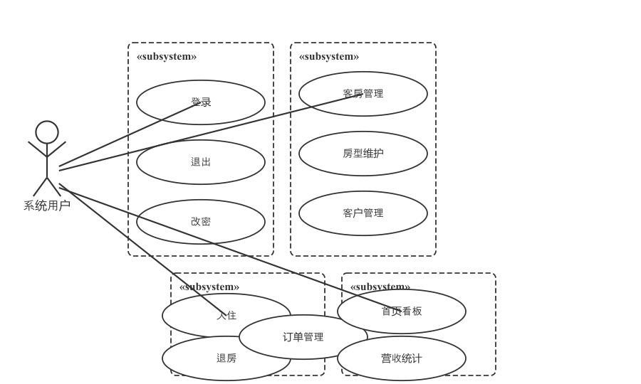
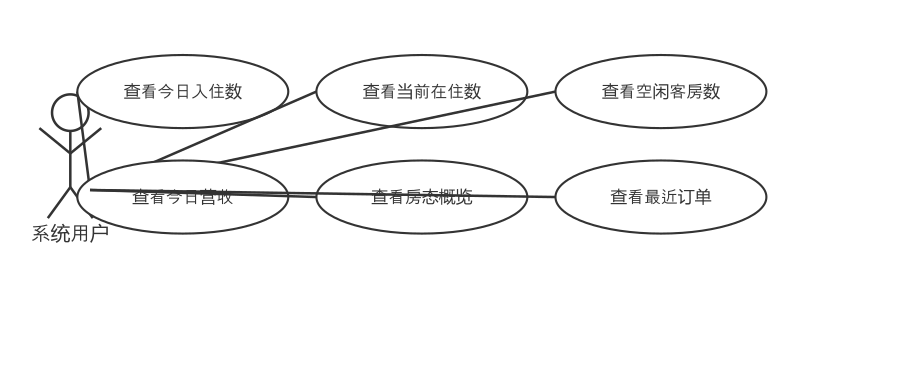
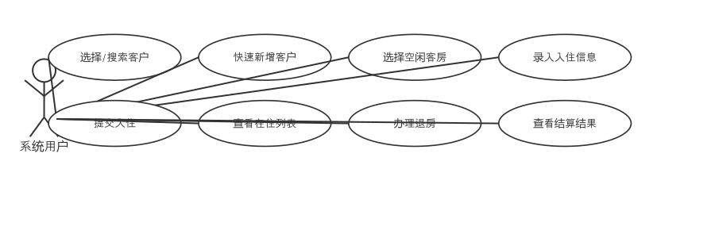
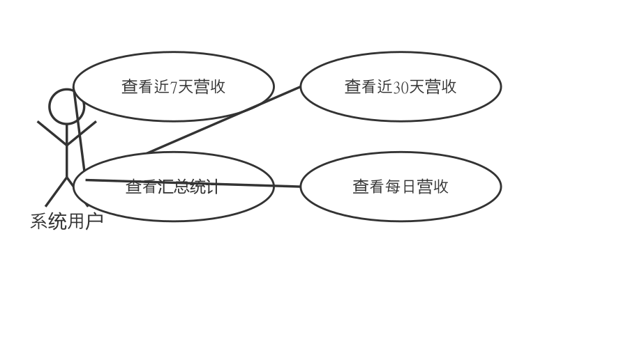
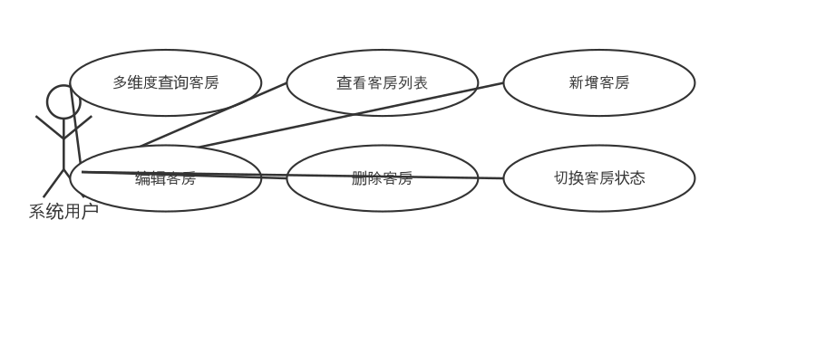
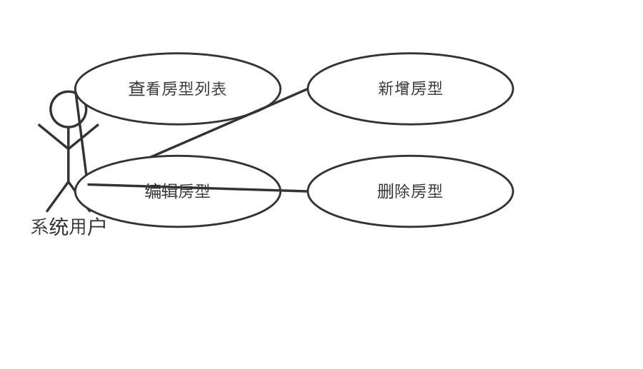
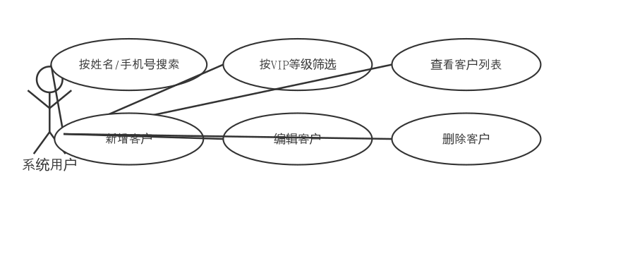
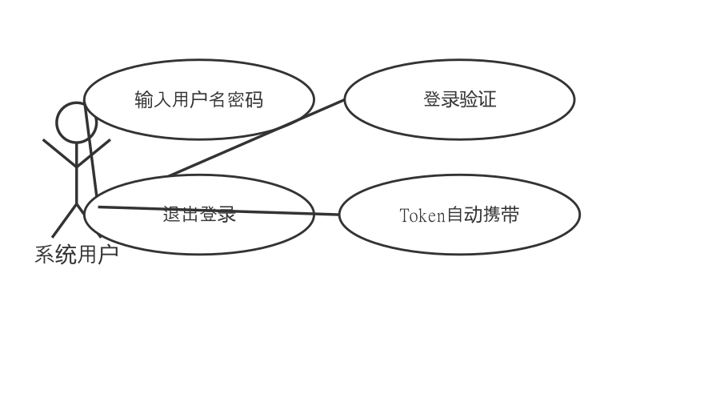
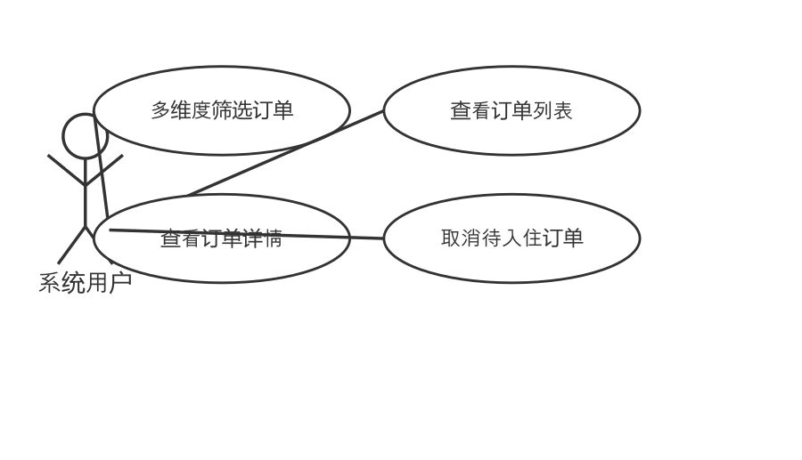
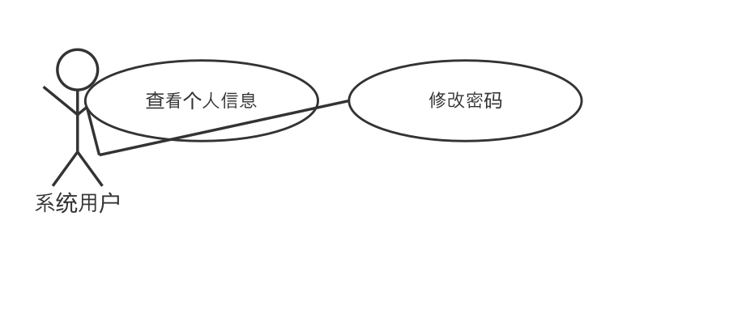

# 锦程酒店运营管理系统 需求说明书

## 1 引言

### 1.1 编写的目的

本文档旨在明确锦程酒店运营管理系统的功能需求、数据需求、接口需求及非功能需求，为系统的设计、开发、测试和验收提供依据。本文档的预期读者包括项目开发团队、项目评审人员及相关指导教师。

### 1.2 项目背景

（1）系统名称：锦程酒店运营管理系统

（2）用户：中小型酒店的前台接待人员及运营管理人员

（3）项目说明：锦程酒店运营管理系统是一个面向中小型酒店的前台运营管理工具，旨在替代传统手工登记方式，实现酒店日常运营的数字化管理。系统覆盖客房管理、客户管理、入住/退房办理、订单追踪与营收统计等核心业务场景。系统采用前后端分离架构，前端基于 Vue 3 + Element Plus 构建 SPA 单页应用，后端通过 Spring Boot RESTful API 提供数据服务，MySQL 数据库承担持久化存储。

（4）该系统为独立运行系统，不依赖其他外部系统或机构的数据接口。

### 1.3 术语定义

| 术语 | 说明 |
|------|------|
| SPA | Single Page Application，单页应用，页面切换无需整页刷新 |
| JWT | JSON Web Token，用于身份认证的 Token 令牌 |
| RESTful API | 符合 REST 架构风格的 HTTP 接口 |
| MyBatis | 一款 Java 持久层框架，支持自定义 SQL 映射 |
| Element Plus | 基于 Vue 3 的桌面端 UI 组件库 |
| Pinia | Vue 3 官方推荐的状态管理库 |
| Axios | 基于 Promise 的 HTTP 请求库 |
| ECharts | 一个基于 JavaScript 的数据可视化图表库 |
| idle | 客房空闲状态 |
| occupied | 客房入住中状态 |
| maintenance | 客房维修中状态 |
| checkedIn | 订单已入住状态 |
| checkedOut | 订单已退房状态 |
| cancelled | 订单已取消状态 |

---

## 2 需求概述

### 2.1 任务目标

本系统主要实现以下业务目标：

（1）实现酒店客房资源的信息化管理，支持按房间号、状态、房型等多维度查询，支持客房新增、编辑、删除及状态快捷切换。

（2）建立统一的客户信息档案，支持客户信息的增删改查，支持按姓名/手机号搜索和 VIP 等级筛选，自动统计客户入住次数。

（3）实现标准化的入住办理流程：选择客户→选择空闲客房→设置入住/退房时间→缴纳押金→自动生成订单号→客房状态流转。

（4）实现标准化的退房结算流程：选择入住订单→设置实际退房时间→自动计算住宿夜数和费用→展示结算明细。

（5）提供订单全生命周期追踪，支持按客户姓名、订单状态、日期范围等多维度筛选查看，支持取消待入住订单。

（6）提供营收数据可视化统计，以柱状图展示近 7 天或近 30 天的营收数据，辅助经营决策。

（7）保障系统访问安全，通过 JWT 认证实现用户登录鉴权，支持密码修改。

### 2.2 用户特点

本系统的最终用户特点如下：

| 用户类型 | 角色 | 操作能力 | 使用场景 | 使用频率 | 计算机水平 |
|---------|------|---------|---------|---------|-----------|
| 运营经理 | manager | 可进行系统全部操作 | 日常酒店运营管理、数据查看 | 每日多次 | 中等 |
| 前台接待 | frontDesk | 可进行日常前台业务操作 | 客户接待、入住退房办理、订单查询 | 每日高频次 | 基础 |

系统操作界面简洁明了，采用通用管理后台布局，用户经过简单培训即可上手操作。

### 2.3 运行环境

1、系统硬件要求

| 项目 | 最低配置 |
|------|---------|
| CPU | Intel Core i5 或同级别处理器 |
| 内存 | 8GB 及以上 |
| 硬盘 | 100GB 及以上可用空间 |

2、系统软件要求

| 类别 | 软件名称 | 版本 |
|------|---------|------|
| 开发工具 | IntelliJ IDEA | 2026.1 |
| 开发工具 | Visual Studio Code | - |
| 开发语言 | Java | 17+ |
| 开发语言 | JavaScript (Vue 3) | ECMAScript 6+ |
| 前端框架 | Vue | 3.5.39 |
| 前端 UI 库 | Element Plus | 2.14.2 |
| 后端框架 | Spring Boot | 2.7.18 |
| 持久层框架 | MyBatis | 2.3.1 |
| 构建工具（前端） | Vite | 8.1.1 |
| 构建工具（后端） | Maven | 3.6+ |
| 数据库 | MySQL | 8.0 |
| 数据库管理工具 | Navicat / MySQL Workbench | - |
| 操作系统 | Windows 10/11 | - |
| 浏览器 | Chrome / Firefox / Edge | 最新版本 |

---

## 3 功能需求

通过前期对酒店运营管理领域实际业务需求的调研，经分析确定系统功能主要分为以下 9 个部分：系统登录、首页仪表盘、客房管理、房型维护、客户管理、入住退房办理、订单管理、营收统计、个人中心。

任务分工：
- 刘开放 24042110：首页仪表盘、入住退房办理、营收统计
- 李忠泽 24042109：客房管理、房型维护、客户管理
- 史川皓 24042115：系统登录、订单管理、个人中心

### 3.1 系统总体用例图

系统主要有1类用户即系统用户（包括运营经理和前台接待两个角色），系统总体用例图如下：



### 3.2 系统功能概述

#### 3.2.1 首页仪表盘 + 入住退房办理 + 营收统计（刘开放 24042110）

**（一）首页仪表盘**

1、需求描述

首页仪表盘为系统登录后的默认页面，集中展示酒店运营的关键数据指标。页面加载时自动获取统计数据，以四个统计卡片展示今日入住数、当前在住数、空闲客房数和今日营收。同时以网格形式展示所有客房的状态概览（以不同颜色区分空闲、入住中、维修中三种状态）。页面右侧提供快捷操作入口，包括办理入住、新增客户、新增客房和查看订单。页面底部展示最近 5 条订单记录。

2、用例图



3、用例文档

| 项目 | 内容 |
|------|------|
| 用例名称 | 首页仪表盘 |
| 用例标识号 | UC1 |
| 参与者 | 系统用户（经理/前台） |
| 用例描述 | 用户登录后默认进入首页仪表盘，查看酒店运营关键数据指标 |
| 前置条件 | 用户已登录系统 |
| 后置条件 | 无 |
| 基本事件流 | 1. 系统自动获取今日入住数、当前在住数、空闲客房数、今日营收数据；2. 系统获取所有客房列表并以网格形式展示房态；3. 系统获取最近5条订单记录；4. 用户可点击快捷操作按钮跳转到对应功能页面 |
| 扩展事件流 | 统计数据为0时正常显示0值 |

**（二）入住退房办理**

1、需求描述

入住退房办理为系统的核心业务模块，采用标签页形式分为"办理入住"和"在住列表"两个页面。办理入住时，用户选择或搜索已有客户，当客户不存在时可快速弹窗新增客户。选择空闲客房后设置入住时间和预计退房时间，录入押金，提交后系统自动生成订单号、创建订单、更改客房状态为入住中并增加客户入住次数。在住列表展示所有已入住订单，可选择办理退房，系统自动计算住宿夜数（向上取整）、总金额（价格 x 夜数）及应补/应退金额（总金额 - 押金），退房后订单状态变更为已退房，客房恢复为空闲。

2、用例图



3、用例文档

| 项目 | 内容 |
|------|------|
| 用例名称 | 办理入住 |
| 用例标识号 | UC2 |
| 参与者 | 系统用户（经理/前台） |
| 用例描述 | 用户选择客户和空闲客房，录入入住信息，为客人办理入住 |
| 前置条件 | 系统中存在客户信息，且有空闲状态的客房 |
| 后置条件 | 订单状态为"已入住"，客房状态变更为"入住中"，客户入住次数+1 |
| 基本事件流 | 1. 用户选择或搜索已有客户；2. 如客户不存在，通过弹窗快速新增客户；3. 选择空闲客房；4. 设置入住时间和预计退房时间；5. 录入押金金额；6. 可选填写备注；7. 提交办理入住；8. 系统自动生成订单号并创建订单；9. 系统更改客房状态为occupied；10. 客户入住次数+1；11. 提示成功并可查看在住列表 |
| 扩展事件流 | 所选客房不是空闲状态时，提示"客房不是空闲状态，无法办理入住" |

| 项目 | 内容 |
|------|------|
| 用例名称 | 办理退房 |
| 用例标识号 | UC3 |
| 参与者 | 系统用户（经理/前台） |
| 用例描述 | 用户选择已入住订单，设置实际退房时间，完成退房结算 |
| 前置条件 | 存在已入住（checkedIn）状态的订单 |
| 后置条件 | 订单状态变更为"已退房"，客房状态恢复为"空闲" |
| 基本事件流 | 1. 用户在在住列表中选择要退房的订单；2. 设置实际退房时间；3. 系统自动计算：住宿夜数=向上取整(入住时长/24小时)，总金额=单价x夜数，应补/应退=总金额-押金；4. 用户确认退房；5. 系统更新订单状态和金额；6. 客房状态恢复为空闲；7. 展示结算结果 |
| 扩展事件流 | 订单不是"已入住"状态时，提示"只有已入住订单才能退房" |

**（三）营收统计**

1、需求描述

营收统计模块以 ECharts 柱状图展示酒店营收数据，默认展示近 7 天的营收走势，支持切换至近 30 天视图。页面顶部展示汇总统计卡片：总营收、订单数、平均客单价。柱状图支持鼠标悬停查看每日具体营收金额。

2、用例图



3、用例文档

| 项目 | 内容 |
|------|------|
| 用例名称 | 营收统计 |
| 用例标识号 | UC4 |
| 参与者 | 系统用户（经理/前台） |
| 用例描述 | 用户查看营收数据统计图表和汇总数据 |
| 前置条件 | 存在已退房且已完成结算的订单 |
| 后置条件 | 无 |
| 基本事件流 | 1. 用户进入营收统计页面；2. 系统默认展示近7天营收柱状图；3. 页面顶部展示总营收、订单数、平均客单价；4. 用户可切换至近30天视图；5. 鼠标悬停可查看每日具体数值 |
| 扩展事件流 | 无统计数据时图表和卡片均显示0 |

#### 3.2.2 客房管理 + 房型维护 + 客户管理（李忠泽 24042109）

**（一）客房管理**

1、需求描述

客房管理模块实现客房信息的全面管理。用户可按房间号关键词、状态（空闲/入住中/维修中）、房型进行三维筛选查询。客房列表以分页表格展示房间号、房型名称、楼层、价格、状态和备注。支持新增客房（填写房间号、选择房型、楼层、价格、状态），编辑客房信息，删除客房（二次确认），以及快捷切换客房状态（设为维修/恢复空闲）。房间号在新增和编辑时进行唯一性校验。

2、用例图



3、用例文档

| 项目 | 内容 |
|------|------|
| 用例名称 | 客房管理 |
| 用例标识号 | UC5 |
| 参与者 | 系统用户（经理/前台） |
| 用例描述 | 用户对酒店客房信息进行增删改查和状态切换操作 |
| 前置条件 | 用户已登录系统，存在至少一个房型 |
| 后置条件 | 新增/修改/删除操作后客房列表自动刷新 |
| 基本事件流 | 1. 用户进入客房管理页面，列表默认分页展示；2. 用户可按房间号、状态、房型筛选查询；3. 用户可新增客房，填写信息后保存；4. 用户可选择编辑客房，修改信息后保存；5. 用户可删除客房，二次确认后删除；6. 用户可一键切换客房状态（维修/空闲） |
| 扩展事件流 | 新增/编辑时房间号已存在，提示"房间号已存在" |

**（二）房型维护**

1、需求描述

房型维护模块管理房型的基础配置数据，包括房型名称、床型、容纳人数。房型列表无需分页展示所有房型，支持新增、编辑和删除操作。房型数据是客房管理的基础配置，新增客房时必须从已有房型中选择。初始化数据包括单人间（单人床/1人）、双人间（两张单人床/2人）、大床房（一张大床/2人）、豪华套房（一张大床+客厅/3人）。

2、用例图



3、用例文档

| 项目 | 内容 |
|------|------|
| 用例名称 | 房型维护 |
| 用例标识号 | UC6 |
| 参与者 | 系统用户（经理/前台） |
| 用例描述 | 用户对酒店房型基础数据进行增删改查操作 |
| 前置条件 | 用户已登录系统 |
| 后置条件 | 新增/修改/删除操作后房型列表自动刷新 |
| 基本事件流 | 1. 用户进入房型维护页面，查看所有房型；2. 用户可新增房型，填写名称、床型、容纳人数后保存；3. 用户可选择编辑房型；4. 用户可删除房型 |
| 扩展事件流 | 删除已被客房引用的房型时，需提示约束冲突 |

**（三）客户管理**

1、需求描述

客户管理模块建立统一的客户信息档案。用户可按姓名/手机号关键词进行模糊搜索，按 VIP 等级（普通会员/银卡会员/金卡会员/钻石会员）筛选。客户列表以分页表格展示姓名、手机号、身份证号、性别、VIP 等级、入住次数和备注。客户信息使用不同颜色的标签展示 VIP 等级。支持新增客户（姓名和手机号为必填项），编辑客户信息和删除客户。

2、用例图



3、用例文档

| 项目 | 内容 |
|------|------|
| 用例名称 | 客户管理 |
| 用例标识号 | UC7 |
| 参与者 | 系统用户（经理/前台） |
| 用例描述 | 用户对客户信息进行增删改查和 VIP 等级管理 |
| 前置条件 | 用户已登录系统 |
| 后置条件 | 新增/修改/删除操作后客户列表自动刷新 |
| 基本事件流 | 1. 用户进入客户管理页面，列表默认分页展示；2. 用户可按姓名或手机号关键词搜索，按VIP等级筛选；3. 用户可新增客户，填写信息后保存（姓名和手机号必填）；4. 用户可选择编辑客户；5. 用户可删除客户 |
| 扩展事件流 | 搜索无结果时显示空表格 |

#### 3.2.3 系统登录 + 订单管理 + 个人中心（史川皓 24042115）

**（一）系统登录**

1、需求描述

系统登录模块实现用户的身份认证。用户输入用户名和密码，系统通过后端验证后在本地存储 JWT Token 并跳转至首页。系统使用 Axios 请求拦截器自动在所有请求中携带 Token，使用 Vue Router 路由守卫拦截未登录用户的访问。密码使用 MD5 算法加密存储。默认预填用户名 admin 和密码 123456 方便演示。

2、用例图



3、用例文档

| 项目 | 内容 |
|------|------|
| 用例名称 | 系统登录 |
| 用例标识号 | UC8 |
| 参与者 | 系统用户（经理/前台） |
| 用例描述 | 用户通过用户名和密码登录系统，获得操作权限 |
| 前置条件 | 数据库中存在有效的用户账户 |
| 后置条件 | 用户获得 Token，可访问系统功能页面 |
| 基本事件流 | 1. 用户访问系统，自动跳转至登录页；2. 用户输入用户名和密码；3. 系统验证用户名和密码；4. 验证通过后返回 JWT Token 和用户信息；5. 前端将 Token 存储至 localStorage 和 Pinia；6. 自动跳转至首页仪表盘 |
| 扩展事件流 | 用户名或密码错误时，提示"用户名或密码错误" |

**（二）订单管理**

1、需求描述

订单管理模块实现订单的查询和追踪。列表默认分页展示，支持按客户姓名关键词、订单状态（待入住/已入住/已退房/已取消）和入住日期范围进行三维筛选。订单列表展示订单号、客户、房间号、入住时间、预计退房、押金、结算金额和状态。用户可查看订单详情（完整信息展示），以及取消待入住状态的订单。取消订单时需二次确认。

2、用例图



3、用例文档

| 项目 | 内容 |
|------|------|
| 用例名称 | 订单管理 |
| 用例标识号 | UC9 |
| 参与者 | 系统用户（经理/前台） |
| 用例描述 | 用户查看和管理酒店订单信息 |
| 前置条件 | 用户已登录系统，存在订单数据 |
| 后置条件 | 取消订单后订单状态变更为"已取消"，客房恢复空闲 |
| 基本事件流 | 1. 用户进入订单管理页面，列表默认分页展示；2. 用户可按客户姓名、订单状态、入住日期范围筛选查询；3. 用户可点击查看订单完整详情；4. 用户可选择待入住订单进行取消操作（二次确认） |
| 扩展事件流 | 非待入住状态的订单取消按钮不显示 |

**（三）个人中心**

1、需求描述

个人中心模块展示当前登录用户的信息（头像、真实姓名、角色、用户名），并支持修改密码功能。修改密码时需输入旧密码、新密码和确认新密码，新密码长度不少于6位且两次输入需一致。修改成功后清除登录状态，跳转至登录页重新登录。

2、用例图



3、用例文档

| 项目 | 内容 |
|------|------|
| 用例名称 | 个人中心 |
| 用例标识号 | UC10 |
| 参与者 | 系统用户（经理/前台） |
| 用例描述 | 用户查看个人信息和修改登录密码 |
| 前置条件 | 用户已登录系统 |
| 后置条件 | 修改密码成功后清除 Token 并跳转至登录页 |
| 基本事件流 | 1. 用户进入个人中心，查看个人信息；2. 用户输入旧密码、新密码和确认新密码；3. 系统验证旧密码正确性和新密码格式；4. 修改成功后提示重新登录 |
| 扩展事件流 | 旧密码错误时提示"原密码错误"；新密码长度不足6位时提示"新密码长度不能少于6位"；两次新密码不一致时提示"两次输入的新密码不一致" |

### 3.3 系统非功能需求

（1）安全性
- 用户密码使用 MD5 加密存储，确保密码安全
- 接口访问需通过 JWT Token 鉴权，Token 有效期 24 小时
- 除登录接口外，所有 /api/ 接口均需经过登录拦截器验证
- 前端 Token 存储于 localStorage，通过 Axios 拦截器自动携带
- 支持 CORS 跨域配置

（2）可用性
- 前端 SPA 单页应用，页面切换无需刷新
- 所有列表操作后自动刷新数据
- 所有删除操作均需二次确认
- 错误信息通过 Element Plus Message 组件友好提示
- 未登录状态自动跳转至登录页，已登录状态自动跳转至首页

（3）性能
- 后端接口默认分页，控制单次查询数据量
- 前端列表页每页显示 10 条记录
- 数据统计采用后台聚合查询

（4）兼容性
- 前端兼容主流现代浏览器（Chrome、Firefox、Edge）
- 后端基于 Spring Boot 2.7，支持 JDK 17+
- 数据库使用 MySQL 8.0，字符集 utf8mb4

（5）可维护性
- 后端采用三层架构：Controller -> Service -> Mapper
- 前端采用组件化开发，视图与逻辑分离
- 统一响应结果封装
- 全局异常处理

---

## 4 拟采用的技术

### 4.1 前端技术

| 技术 | 版本 | 用途 | 选用理由 |
|------|------|------|---------|
| Vue | 3.5.39 | 前端框架 | 组件化开发，响应式数据绑定，生态丰富 |
| Element Plus | 2.14.2 | UI 组件库 | 提供表格、表单、弹窗、分页等开箱即用的管理后台组件 |
| Vite | 8.1.1 | 构建工具 | 开发服务器热更新速度快，支持代理配置解决跨域 |
| Axios | 1.18.1 | HTTP 请求库 | 支持请求/响应拦截器，方便统一处理 Token 和错误 |
| Pinia | 3.0.4 | 状态管理 | Vue 3 官方推荐，API 简洁，支持 TypeScript |
| Vue Router | 4.6.4 | 路由管理 | 支持懒加载和路由守卫，实现页面级权限控制 |
| ECharts | 6.1.0 | 图表库 | 功能强大的数据可视化库，支持丰富的图表类型和交互 |

### 4.2 后端技术

| 技术 | 版本 | 用途 | 选用理由 |
|------|------|------|---------|
| Spring Boot | 2.7.18 | Web 框架 | 简化 Spring 配置，内嵌 Tomcat，快速构建 RESTful API |
| MyBatis | 2.3.1 | 持久层框架 | SQL 灵活可控，支持动态 SQL，适合复杂查询场景 |
| MySQL | 8.0 | 数据库 | 成熟稳定，性能优秀，广泛使用 |
| JWT (jjwt) | 0.9.1 | 身份认证 | 无状态认证，无需服务端存储会话信息 |
| Lombok | 1.18.46 | 代码简化 | 通过注解减少 Java Bean 的样板代码 |

### 4.3 系统架构

系统采用前后端分离架构，前端 Vue 3 SPA 应用独立部署，通过 HTTP 请求调用后端 RESTful API。开发时前端运行于 8081 端口，后端运行于 8080 端口，通过 Vite 代理解决跨域问题。

```
浏览器 (Vue 3 SPA)  --HTTP /api/*-->  Spring Boot 2.7 (:8080)  --JDBC-->  MySQL 8.0 (hotel_db)
                         (Vite 代理)
```

---

文档版本：V1.0 | 编写日期：2026-07-03 | 编写人员：刘开放 24042110、李忠泽 24042109、史川皓 24042115
