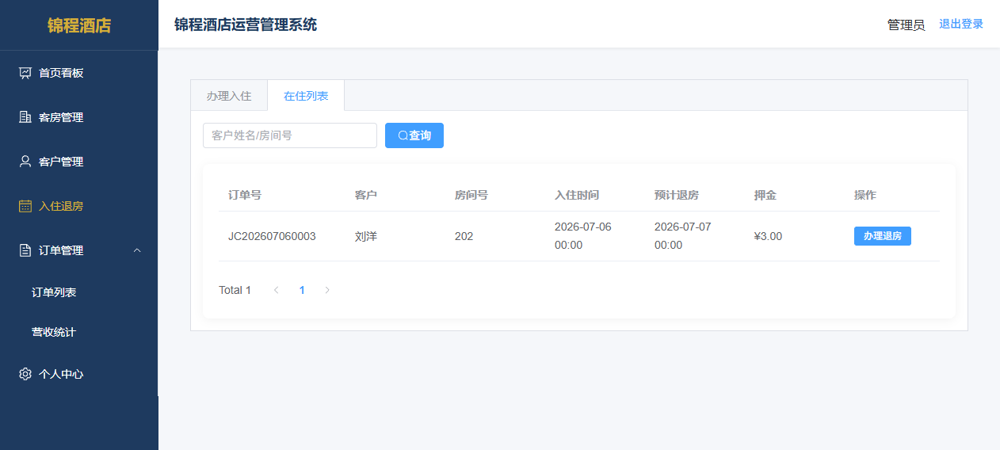
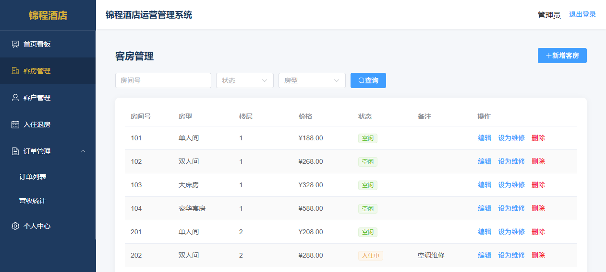
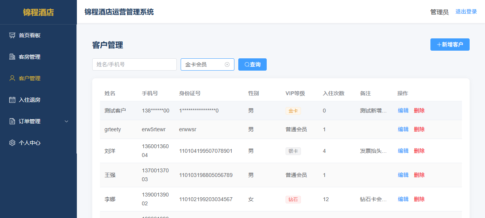
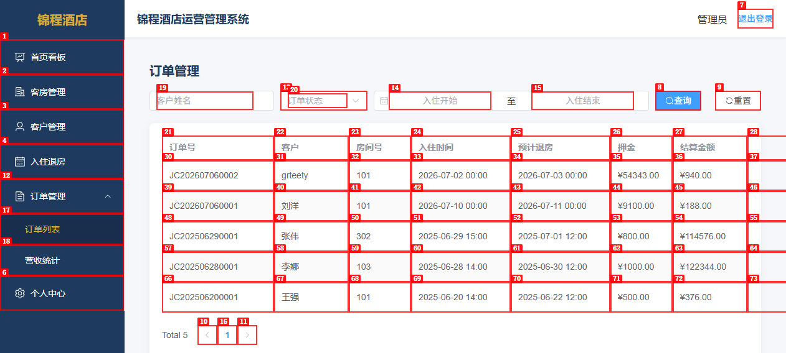
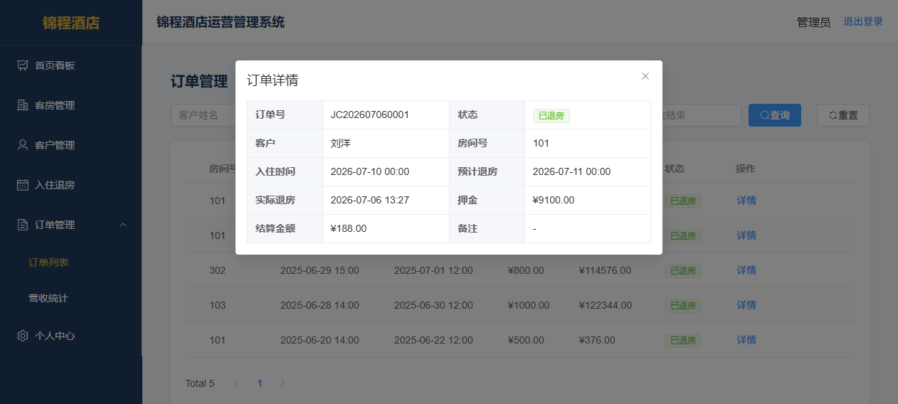

# Dogfood Report: 锦程酒店运营管理系统

| Field | Value |
|-------|-------|
| **Date** | 2026-07-06 |
| **App URL** | http://localhost:8081 |
| **Session** | jincheng-hotel |
| **Tester** | AI Agent (dogfood) |
| **Scope** | 全功能测试：客房管理、客户管理、入住退房、订单管理、营收统计、个人中心 |

## Summary

| Severity | Count |
|----------|-------|
| Critical | 0 |
| High | 1 |
| Medium | 3 |
| Low | 2 |
| **Total** | **6** |

### 测试覆盖概览

| 模块 | 功能点 | 测试结果 |
|------|--------|----------|
| 登录 | admin/123456登录 | ✅ 通过 |
| 首页看板 | 统计卡片、房态概览、最近订单、快捷操作 | ✅ 通过（兜底正常） |
| 客房管理 | 新增客房 | ✅ 通过 |
| 客房管理 | 编辑客房 | ⚠️ 存在问题（ISSUE-002） |
| 客房管理 | 删除客房 | ⚠️ 存在问题（ISSUE-001） |
| 客房管理 | 设为维修/恢复空闲 | ⚠️ 存在问题（ISSUE-001、ISSUE-003） |
| 客房管理 | 搜索（房间号/状态/房型） | ✅ 通过（page重置为1） |
| 客房管理 | 分页 | ✅ 通过 |
| 客户管理 | 新增客户 | ✅ 通过 |
| 客户管理 | 编辑客户 | ✅ 通过 |
| 客户管理 | 删除客户 | ✅ 通过 |
| 客户管理 | VIP等级筛选 | ⚠️ 存在问题（ISSUE-004） |
| 客户管理 | 搜索（姓名/手机号） | ✅ 通过（page重置为1） |
| 客户管理 | 分页 | ✅ 通过 |
| 入住退房 | 办理入住 | ✅ 通过 |
| 入住退房 | 办理退房 | ⚠️ 存在问题（ISSUE-005） |
| 入住退房 | 快速新增客户 | ✅ 通过 |
| 入住退房 | 在住列表搜索/分页 | ✅ 通过（page重置为1） |
| 订单管理 | 订单列表 | ✅ 通过 |
| 订单管理 | 搜索（客户姓名/状态/日期范围） | ✅ 通过（page重置为1） |
| 订单管理 | 查看详情 | ✅ 通过 |
| 订单管理 | 重置按钮 | ✅ 通过 |
| 营收统计 | 近7天/近30天切换、图表、统计卡片 | ✅ 通过 |
| 个人中心 | 查看个人信息 | ✅ 通过 |
| 个人中心 | 修改密码（含错误旧密码校验） | ✅ 通过（全局拦截器提示） |
| 个人中心 | 重置表单 | ✅ 通过 |

---

## Issues

### ISSUE-001: 后端缺少房间状态安全校验，入住中房间可被直接删除/修改状态

| Field | Value |
|-------|-------|
| **Severity** | high |
| **Category** | functional / security |
| **URL** | http://localhost:8081/#/rooms |
| **Code Location** | `jchotel-backend/.../service/impl/RoomServiceImpl.java:64-73` |

**Description**

后端 `RoomServiceImpl` 的 `updateStatus()` 和 `delete()` 方法缺少对房间状态的校验：
- `updateStatus(Long id, String status)` 直接更新房间状态，不校验房间当前是否为"入住中(occupied)"
- `delete(Long id)` 直接删除房间记录，不校验房间是否处于入住中状态
- `update(Room room)` 也没有状态校验

虽然前端 `Room.vue` 的 `setStatus()` 方法对"入住中→维修中"的操作做了拦截（弹出warning提示），但：
1. 前端校验可被绕过（直接调用API）
2. 删除操作前端和后端都没有校验入住中状态
3. 编辑操作可以直接修改状态下拉框的值来改变入住中房间的状态

这会导致：入住中的房间可以被直接删除或改为空闲/维修，造成订单与房间数据不一致。

**Repro Steps**

1. 进入入住退房页面，成功办理一个入住（如刘洋入住202房间），此时202状态为"入住中"
   

2. 进入客房管理页面，202房间显示"入住中"状态
   

3. 通过API直接调用 `PUT /api/rooms/{id}/status?status=maintenance` 或 `DELETE /api/rooms/{id}`，后端不做校验直接执行

**代码证据**

`RoomServiceImpl.java:70-73` - updateStatus无状态校验：
```java
@Override
public Result<String> updateStatus(Long id, String status) {
    roomMapper.updateStatus(id, status);  // 直接更新，无校验
    return Result.success("状态更新成功", null);
}
```

`RoomServiceImpl.java:64-67` - delete无状态校验：
```java
@Override
public Result<String> delete(Long id) {
    roomMapper.deleteById(id);  // 直接删除，无校验
    return Result.success("删除成功", null);
}
```

**Expected Behavior**

后端应在 `updateStatus`、`delete`、`update` 方法中校验房间状态：
- 入住中(occupied)的房间不能设为维修
- 入住中(occupied)的房间不能被删除
- 编辑时不允许直接修改入住中房间的状态（或只能在退房流程中修改）

---

### ISSUE-002: 编辑客房时可以任意修改入住中房间的状态（绕过校验）

| Field | Value |
|-------|-------|
| **Severity** | medium |
| **Category** | functional |
| **URL** | http://localhost:8081/#/rooms |
| **Code Location** | `jchotel-frontend/src/views/Room.vue:73-78` |

**Description**

客房管理页面的编辑对话框中，"状态"字段使用了 `el-select` 下拉框，允许用户选择"空闲"、"入住中"、"维修中"三种状态。当编辑一个处于"入住中"状态的房间时，用户可以手动将状态改为"空闲"或"维修中"并提交，绕过了"设为维修"按钮的前端校验（`setStatus`方法中的occupied判断）。

同时，后端 `update` 方法也没有状态校验来防止这种情况。

**Repro Steps**

1. 确保存在入住中的房间（如办理入住后）
2. 进入客房管理页面，找到入住中的房间
3. 点击"编辑"按钮，打开编辑对话框
4. 在"状态"下拉框中将"入住中"改为"空闲"或"维修中"
5. 点击"确定"提交

**Observe:** 表单提交成功，房间状态被直接修改，绕过了"入住中房间不能设为维修"的业务规则。

**Expected Behavior**

- 编辑入住中房间时，状态字段应禁用或不显示，禁止手动修改
- 或者后端在update时校验，不允许将occupied状态的房间直接改为idle/maintenance（只能通过退房流程改为idle）

---

### ISSUE-003: 入住中房间的"设为维修"按钮未禁用，用户体验不佳

| Field | Value |
|-------|-------|
| **Severity** | medium |
| **Category** | ux |
| **URL** | http://localhost:8081/#/rooms |
| **Code Location** | `jchotel-frontend/src/views/Room.vue:42` |

**Description**

当房间状态为"入住中"(occupied)时，操作列仍然显示"设为维修"按钮（与空闲房间显示相同）。用户点击后才弹出"入住中的房间不能设为维修，请先办理退房"的警告提示。

更好的UX做法是：入住中房间的"设为维修"按钮应禁用(disabled)并显示tooltip，或者直接隐藏该按钮，避免误导用户点击。

**Repro Steps**

1. 办理入住使某房间变为"入住中"状态
2. 进入客房管理页面，找到该入住中房间
3. **Observe:** 操作列仍然显示"设为维修"按钮（可点击状态）
   

4. 点击"设为维修"按钮
5. **Observe:** 弹出警告提示"入住中的房间不能设为维修，请先办理退房"（前端有拦截）

**Expected Behavior**

入住中房间的"设为维修"按钮应置灰禁用，hover时提示"该房间当前有客人入住，无法设为维修"，或者直接不显示该按钮。

---

### ISSUE-004: 客户管理VIP筛选缺少"全部"选项，重置不直观

| Field | Value |
|-------|-------|
| **Severity** | medium |
| **Category** | ux / functional |
| **URL** | http://localhost:8081/#/customers |
| **Code Location** | `jchotel-frontend/src/views/Customer.vue:12-17` |

**Description**

客户管理页面的VIP等级筛选下拉框（`el-select`配置了`clearable`）没有显式的"全部"选项。虽然Element Plus的clearable属性会在选中后显示×号清空按钮，但：
1. ×号只在hover到下拉框时才出现，不够直观
2. 客户管理和客房管理页面都没有"重置"按钮（订单管理页面Order.vue有重置按钮）
3. 用户选择VIP等级后，如果想查看全部客户，需要hover到下拉框上找到×号点击，操作不够便捷

在实际测试过程中，选中VIP等级后一度无法找到重置方式，需要通过切换菜单重新进入页面来重置筛选条件。

**Repro Steps**

1. 进入客户管理页面
2. 在VIP等级下拉框中选择"金卡会员"
3. 列表筛选显示金卡会员（如张伟）
   
4. **Observe:** 搜索栏没有"重置"按钮，VIP下拉框也没有"全部"选项
5. 尝试不hover直接看下拉框，找不到清空方式

**Expected Behavior**

- VIP等级下拉框应添加"全部"选项（value为空/null）
- 或者客户管理页面应添加"重置"按钮（与订单管理页面一致）
- 或者至少在clearable的×号旁有更明显的清空提示

---

### ISSUE-005: 退房结算信息1.5秒后自动关闭，用户来不及查看

| Field | Value |
|-------|-------|
| **Severity** | low |
| **Category** | ux |
| **URL** | http://localhost:8081/#/checkin |
| **Code Location** | `jchotel-frontend/src/views/Checkin.vue:251-253` |

**Description**

办理退房成功后，退房对话框中会显示结算信息：住宿夜数、总金额、押金、应补/应退金额。但代码中使用了 `setTimeout(() => { this.checkoutDialogVisible = false }, 1500)`，1.5秒后自动关闭对话框。

1.5秒时间过短，用户可能来不及看清结算详情（特别是应补/应退金额），应该让用户手动点击确认后关闭，或者延长显示时间。

**Repro Steps**

1. 进入入住退房→在住列表
2. 对在住订单点击"办理退房"
3. 在退房对话框中点击"确认退房"
4. 对话框显示结算信息（住宿夜数、总金额、押金、应补/应退）
5. **Observe:** 仅1.5秒后对话框自动关闭，来不及仔细查看

**代码证据**

`Checkin.vue:251-253`:
```javascript
setTimeout(() => {
  this.checkoutDialogVisible = false
}, 1500)
```

**Expected Behavior**

- 退房结算信息应显示"完成"按钮，用户点击后再关闭
- 或者至少延长自动关闭时间至3-5秒，并添加"完成"按钮让用户可提前关闭

---

### ISSUE-006: 退房时间缺少合理性校验，可产生异常高额订单数据

| Field | Value |
|-------|-------|
| **Severity** | low |
| **Category** | functional |
| **URL** | http://localhost:8081/#/orders |
| **Code Location** | `jchotel-backend/.../service/impl/OrderServiceImpl.java:118-125` |

**Description**

退房计算逻辑仅按"入住到退房的分钟数/1440向上取整"计算住宿晚数，缺少合理性校验：
1. 不校验实际退房时间是否晚于当前时间（可以选未来的时间退房）
2. 不校验入住和退房时间跨度是否合理（可以选跨度几百天）
3. 测试数据中出现了押金¥54343、¥9100，结算金额¥114576（308元×372晚）、¥122344（328元×373晚）的异常记录

这些异常数据可能是由于日期选择器操作问题导致误选了很久以后的日期，但暴露了系统缺乏业务合理性校验。同时，订单列表中存在入住时间为未来日期（2026-07-10）但状态为"已退房"的异常记录。

**Repro Steps**

1. 进入订单管理→订单列表
2. **Observe:** 列表中存在异常高额订单
   
   - 张伟-302房间：押金¥800，结算¥114,576.00（约372晚）
   - 李娜-103房间：押金¥1000，结算¥122,344.00（约373晚）
   - 存在入住时间为未来日期但已退房的矛盾数据

3. 进入订单详情，可看到时间逻辑矛盾（入住时间晚于退房时间）
   

**Expected Behavior**

- 退房时实际退房时间不能晚于当前时间
- 对入住/退房时间跨度做合理性校验（如超过30天给出警告）
- 押金和结算金额超过合理阈值时给出提示或限制

---

## 特殊需求验证结果

| 需求点 | 验证结果 | 说明 |
|--------|----------|------|
| 入住中房间不能设为维修 | ⚠️ 前端有弹窗提示，后端无校验 | 前端setStatus有拦截，但后端API可绕过；且编辑功能可绕过 |
| 所有搜索后page重置为1 | ✅ 正确 | Customer/Room/Order/Checkin各页面handleSearch均设置page=1 |
| 性别null不显示为女 | ✅ 正确 | Customer.vue的genderText方法对非M/F返回'-' |
| Dashboard统计数据兜底 | ✅ 正确 | stats初始值全为0，使用spread运算符合并，catch重置为0 |

## 其他说明

1. **修改密码功能**：输入错误旧密码时，全局axios响应拦截器会弹出"原密码错误"的ElMessage提示，功能正常。重置按钮使用`resetFields()`正常工作。
2. **营收统计图表**：近7天/近30天切换正常，Canvas图表正常渲染，统计卡片显示总营收、订单数、平均客单价。
3. **快速新增客户**：在入住退房页面点击"+ 快速新增客户"，弹出简化的客户新增表单（姓名、手机号、身份证号、性别），新增成功后自动刷新客户列表，功能正常。
4. **分页功能**：所有列表页分页均正常工作（上一页/下一页/页码跳转）。
5. **搜索功能**：房间号搜索、客户姓名/手机号搜索、订单搜索均正常工作。

